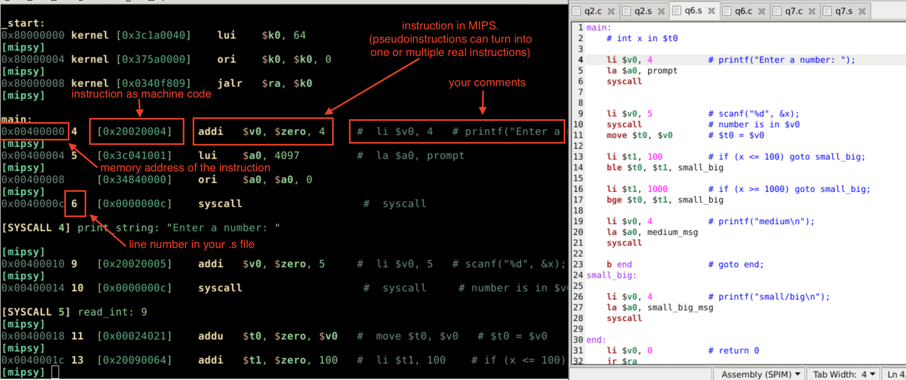

# Week 2 Tutorial

## Terminal Commands for MIPS

- write MIPS code using your regular text editor
- open mipsy using `1521 mipsy`
    - use `help` for list of commands
    - if you just want to run the code, you can use `1521 mipsy <filename.s>`
- open QtSpim with `qtspim`

## mipsy Intro

This is what your typical MIPS program might look like in mipsy. What I've done here is to step forward with `step`.

- Type `help` for commands
- Ask on forum for help or to report bugs
